# Forest System Architecture

This document describes the current and proposed architecture for Forest, including the thin client mode design.

## Table of Contents
1. [Current Architecture](#current-architecture)
2. [Identified Issues](#identified-issues)
3. [Proposed Thin Client Architecture](#proposed-thin-client-architecture)
4. [Component Details](#component-details)
5. [Code Reorganization Plan](#code-reorganization-plan)
6. [Migration Path](#migration-path)

---

## Current Architecture

### High-Level Component View

```mermaid
graph TB
    User[👤 User]
    CLI[CLI Layer<br/>src/cli]
    Server[API Server<br/>src/server]
    Core[Core Business Logic<br/>src/core]
    Lib[Infrastructure<br/>src/lib]
    DB[(SQLite DB<br/>forest.db)]

    User -->|Commands| CLI
    User -->|HTTP| Server

    CLI --> Core
    Server --> Core

    Core --> Lib
    Lib --> DB

    style CLI fill:#e1f5ff
    style Server fill:#e1f5ff
    style Core fill:#fff4e6
    style Lib fill:#f3e5f5
    style DB fill:#e8f5e9
```



### Current Layer Dependencies (WITH ISSUES ⚠️)


**Problem**: Core layer has circular dependencies!
- `src/core/nodes.ts` imports from `src/cli/shared/linking.ts`
- `src/core/nodes.ts` imports from `src/server/events/eventBus.ts`

This violates the dependency rule: **Core should not depend on CLI or Server layers**.

### Current Directory Structure

```
src/
├── cli/                    # CLI interface
│   ├── commands/           # Command handlers
│   ├── formatters/         # Output formatting
│   ├── shared/             # Shared CLI utilities
│   ├── index.ts            # CLI entry point
│   └── tldr.ts             # TLDR agent documentation
│
├── server/                 # API server
│   ├── routes/             # API route handlers
│   ├── events/             # Event bus
│   ├── utils/              # Server utilities
│   └── index.ts            # Server entry point
│
├── core/                   # ⚠️ Business logic (has bad dependencies)
│   ├── nodes.ts
│   ├── edges.ts
│   ├── search.ts
│   ├── tags.ts
│   ├── stats.ts
│   ├── health.ts
│   ├── import.ts
│   ├── write.ts
│   └── synthesize.ts
│
├── lib/                    # Infrastructure
│   ├── db.ts               # Database access
│   ├── embeddings.ts       # Embedding computation
│   ├── scoring.ts          # Edge scoring
│   ├── text.ts             # Text processing
│   ├── chunking.ts         # Document chunking
│   ├── graph.ts            # Graph algorithms
│   ├── config.ts           # Configuration
│   └── progressive-id.ts   # ID formatting
│
├── types/                  # Type definitions
│   └── transformers.d.ts
│
└── index.ts                # Main entry point
```

---

## Identified Issues

### 1. **Circular Dependencies** 🔴
- Core layer imports from CLI layer (`cli/shared/linking`, `cli/shared/utils`)
- Core layer imports from Server layer (`server/events/eventBus`)
- Violates clean architecture principles

### 2. **Mixed Responsibilities** 🟡
- `cli/shared/` contains business logic that should be in core
- `linking.ts`, `explore.ts` have graph algorithms mixed with CLI formatting

### 3. **No Data Access Abstraction** 🔴
- Direct database imports throughout core layer
- No interface for swapping data sources
- Cannot support thin client mode without major refactoring

### 4. **Tight Coupling** 🟡
- Core layer directly imports `db.ts` functions
- No dependency injection
- Hard to test, hard to mock

### 5. **Missing Abstractions** 🔴
- No API client interface
- No data access layer (DAL)
- No service layer pattern

---

## Proposed Thin Client Architecture

### Target Architecture - Clean Layers

```mermaid
graph TB
    subgraph "Client Environment"
        User[👤 User]
        CLI[CLI Interface]
        ThinClient[Thin Client Mode]
    end

    subgraph "Data Access Layer"
        DAL{Data Access<br/>Abstraction}
        LocalProvider[Local Provider<br/>Direct DB]
        RemoteProvider[Remote Provider<br/>API Client]
    end

    subgraph "Business Logic"
        Core[Core Services<br/>Pure Functions]
    end

    subgraph "Infrastructure"
        Lib[Utilities<br/>text, scoring, etc.]
        DB[(SQLite DB)]
    end

    subgraph "Server Environment"
        API[API Server]
    end

    User --> CLI
    CLI --> ThinClient
    ThinClient --> DAL
    CLI --> DAL

    DAL --> LocalProvider
    DAL --> RemoteProvider

    LocalProvider --> Core
    RemoteProvider -->|HTTP/HTTPS| API

    Core --> Lib
    Lib --> DB

    API --> Core

    style CLI fill:#e1f5ff
    style ThinClient fill:#81d4fa
    style DAL fill:#fff59d
    style Core fill:#fff4e6
    style Lib fill:#f3e5f5
    style API fill:#90caf9
    style DB fill:#e8f5e9
```



### Mode Selection Flow


### Thin Client Communication Flow


### Component Interaction Matrix


---

## Component Details

### Data Access Layer (DAL)

**Purpose**: Abstract data source, enabling local or remote data access

**Interface** (`src/data/IDataProvider.ts`):
```typescript
export interface IDataProvider {
  // Node operations
  listNodes(options: ListNodesOptions): Promise<ListNodesResult>;
  getNode(id: string, options?: GetNodeOptions): Promise<GetNodeResult>;
  createNode(data: CreateNodeInput): Promise<NodeRecord>;
  updateNode(id: string, data: UpdateNodeInput): Promise<NodeRecord>;
  deleteNode(id: string): Promise<void>;

  // Edge operations
  listEdges(options: ListEdgesOptions): Promise<ListEdgesResult>;
  createEdge(data: CreateEdgeInput): Promise<EdgeRecord>;
  updateEdge(id: string, data: UpdateEdgeInput): Promise<EdgeRecord>;
  deleteEdge(id: string): Promise<void>;

  // Search operations
  search(query: string, options?: SearchOptions): Promise<SearchResult>;

  // Tag operations
  listTags(options?: ListTagsOptions): Promise<TagsResult>;

  // Stats operations
  getStats(): Promise<StatsResult>;
  getHealth(): Promise<HealthResult>;
}
```

**Implementations**:

1. **LocalProvider** (`src/data/providers/LocalProvider.ts`)
   - Calls core functions directly
   - Uses local SQLite database
   - Full feature set

2. **RemoteProvider** (`src/data/providers/RemoteProvider.ts`)
   - Makes HTTP/HTTPS requests to API server
   - Handles authentication, retries, errors
   - Limited by API feature set

**Factory** (`src/data/DataProviderFactory.ts`):
```typescript
export function createDataProvider(): IDataProvider {
  const mode = process.env.FOREST_MODE;

  if (mode === 'client') {
    const apiUrl = process.env.FOREST_API_URL;
    if (!apiUrl) {
      throw new Error('FOREST_API_URL required in client mode');
    }
    return new RemoteProvider({ apiUrl });
  }

  return new LocalProvider();
}
```

### Core Services Refactoring

**Current Issues**:
- Core imports from CLI and Server layers
- Mixed concerns (business logic + presentation)

**Solution**: Extract pure business logic

**Example - nodes.ts refactoring**:

**BEFORE** (bad):
```typescript
// src/core/nodes.ts
import { linkAgainstExisting } from '../cli/shared/linking'; // ❌ CLI dependency
import { eventBus } from '../server/events/eventBus';      // ❌ Server dependency
```

**AFTER** (clean):
```typescript
// src/core/nodes.ts
import { linkAgainstExisting } from './linking';  // ✅ Core module
import { EventEmitter } from '../lib/events';     // ✅ Infrastructure abstraction

// Pure business logic - no CLI/Server dependencies
```

### Event System Abstraction

**Problem**: Core depends on `server/events/eventBus`

**Solution**: Abstract event system

```typescript
// src/lib/events.ts
export interface IEventBus {
  emit(event: string, data: unknown): void;
  on(event: string, handler: (data: unknown) => void): void;
  off(event: string, handler: (data: unknown) => void): void;
}

// Implementation can be in server or lib
// Core only depends on interface
```

---

## Code Reorganization Plan

### Phase 1: Fix Circular Dependencies ⚠️ CRITICAL

**Goal**: Make core layer independent

**Steps**:

1. **Move shared business logic to core**
   - `cli/shared/linking.ts` → `core/linking.ts`
   - `cli/shared/explore.ts` → `core/explore.ts` (logic only)
   - Keep formatting in `cli/shared/`

2. **Abstract event system**
   - Create `lib/events.ts` with `IEventBus` interface
   - Move `server/events/eventBus.ts` → `lib/events/EventBus.ts`
   - Update core to use interface

3. **Extract utilities**
   - Move pure utilities from `cli/shared/utils.ts` to `lib/utils.ts`
   - Keep CLI-specific formatting in `cli/shared/`

**Result**: Clean dependency flow

```
CLI → Core → Lib
Server → Core → Lib
```

### Phase 2: Create Data Access Layer 🎯

**Goal**: Abstract data source

**New Files**:
```
src/data/
├── IDataProvider.ts           # Interface definition
├── DataProviderFactory.ts     # Factory for mode selection
├── providers/
│   ├── LocalProvider.ts       # Local DB implementation
│   └── RemoteProvider.ts      # API client implementation
└── types.ts                   # Shared types
```

**Steps**:

1. **Define interface** (`IDataProvider.ts`)
   - All data operations as methods
   - Promise-based API
   - Type-safe inputs/outputs

2. **Implement LocalProvider**
   - Wraps existing core functions
   - Direct database access
   - No breaking changes to existing code

3. **Implement RemoteProvider**
   - HTTP client using fetch or axios
   - Request/response mapping
   - Error handling, retries, timeouts

4. **Create factory**
   - Mode detection via `FOREST_MODE` env var
   - Returns appropriate provider
   - Validates configuration

### Phase 3: Update CLI to Use DAL 🔄

**Goal**: CLI commands use abstracted data access

**Changes**:

1. **Update CLI commands**
   - Replace direct core imports with DAL
   - Use `DataProviderFactory.create()`
   - Keep formatting logic in CLI

2. **Example transformation**:

**BEFORE**:
```typescript
// src/cli/commands/stats.ts
import { statsCore } from '../../core/stats';

export async function statsCommand() {
  const stats = await statsCore();
  // format and display
}
```

**AFTER**:
```typescript
// src/cli/commands/stats.ts
import { createDataProvider } from '../../data/DataProviderFactory';

export async function statsCommand() {
  const provider = createDataProvider();
  const stats = await provider.getStats();
  // format and display
}
```

### Phase 4: Enhanced API Client 🌐

**Goal**: Production-ready remote provider

**Features**:

1. **Authentication**
   ```typescript
   {
     apiUrl: 'https://api.forest.dev',
     apiKey: process.env.FOREST_API_KEY,
     timeout: 30000,
     retries: 3
   }
   ```

2. **Error handling**
   - Network errors
   - HTTP error codes
   - Retry logic with exponential backoff

3. **Caching** (optional)
   - Local cache for read operations
   - Cache invalidation
   - Offline mode support

4. **Request/Response logging**
   - Debug mode via `FOREST_DEBUG=true`
   - Request tracing

### Target Directory Structure

```
src/
├── cli/                    # CLI interface (presentation)
│   ├── commands/           # Command handlers
│   ├── formatters/         # Output formatting (tables, colors)
│   ├── shared/             # CLI-specific utilities
│   └── index.ts
│
├── server/                 # API server (presentation)
│   ├── routes/             # HTTP route handlers
│   ├── middleware/         # Auth, logging, etc.
│   └── index.ts
│
├── core/                   # Business logic (PURE - no CLI/Server deps)
│   ├── nodes.ts            # Node operations
│   ├── edges.ts            # Edge operations
│   ├── search.ts           # Search logic
│   ├── tags.ts             # Tag operations
│   ├── stats.ts            # Statistics
│   ├── health.ts           # Health checks
│   ├── import.ts           # Document import
│   ├── write.ts            # Document writing
│   ├── linking.ts          # Graph linking (moved from cli/shared)
│   ├── explore.ts          # Graph exploration (moved from cli/shared)
│   └── synthesize.ts       # Content synthesis
│
├── data/                   # Data Access Layer (NEW)
│   ├── IDataProvider.ts    # Interface
│   ├── DataProviderFactory.ts
│   ├── providers/
│   │   ├── LocalProvider.ts
│   │   └── RemoteProvider.ts
│   └── types.ts
│
├── lib/                    # Infrastructure (utilities, algorithms)
│   ├── db.ts               # Database module
│   ├── embeddings.ts       # Embedding computation
│   ├── scoring.ts          # Edge scoring algorithm
│   ├── text.ts             # Text processing
│   ├── chunking.ts         # Document chunking
│   ├── graph.ts            # Graph algorithms
│   ├── events.ts           # Event bus (moved from server)
│   ├── config.ts           # Configuration
│   ├── utils.ts            # Pure utilities (moved from cli/shared)
│   └── progressive-id.ts   # ID formatting
│
├── types/                  # Type definitions
│   ├── core.ts             # Core domain types
│   └── transformers.d.ts
│
└── index.ts                # Main entry point
```

### Dependency Graph (CLEAN) ✅


**Rules Enforced**:
1. ✅ Core never imports from CLI or Server
2. ✅ CLI and Server only communicate via Core/DAL
3. ✅ Lib is pure infrastructure, no business logic
4. ✅ DAL abstracts data source

---

## Migration Path

### Checklist

#### Phase 1: Fix Dependencies (Week 1) 🔴 CRITICAL

- [ ] **Move linking logic**
  - [ ] Create `src/core/linking.ts`
  - [ ] Move `linkAgainstExisting`, `rescoreNode` from `cli/shared/linking.ts`
  - [ ] Update imports in `core/nodes.ts`
  - [ ] Keep CLI formatting in `cli/shared/linking.ts`

- [ ] **Move explore logic**
  - [ ] Create `src/core/explore.ts`
  - [ ] Extract graph logic from `cli/shared/explore.ts`
  - [ ] Keep display formatting in CLI layer

- [ ] **Abstract event system**
  - [ ] Create `src/lib/events.ts` with `IEventBus` interface
  - [ ] Move `server/events/eventBus.ts` to `lib/events/EventBus.ts`
  - [ ] Update core imports to use interface
  - [ ] Add dependency injection for event bus

- [ ] **Move utilities**
  - [ ] Create `src/lib/utils.ts`
  - [ ] Move pure functions from `cli/shared/utils.ts`
  - [ ] Update imports across codebase

- [ ] **Verify no circular dependencies**
  - [ ] Run `madge --circular src/` or similar tool
  - [ ] Fix any remaining cycles
  - [ ] Add pre-commit hook to detect future cycles

#### Phase 2: Create DAL (Week 2) 🟡

- [ ] **Define data access interface**
  - [ ] Create `src/data/IDataProvider.ts`
  - [ ] Define all data operations
  - [ ] Add comprehensive TypeScript types

- [ ] **Implement LocalProvider**
  - [ ] Create `src/data/providers/LocalProvider.ts`
  - [ ] Wrap existing core functions
  - [ ] Add tests

- [ ] **Create factory**
  - [ ] Create `src/data/DataProviderFactory.ts`
  - [ ] Add mode detection
  - [ ] Add configuration validation

- [ ] **Initial testing**
  - [ ] Unit tests for factory
  - [ ] Integration tests for LocalProvider
  - [ ] Verify existing functionality intact

#### Phase 3: Implement Remote Provider (Week 3) 🟢

- [ ] **Basic HTTP client**
  - [ ] Create `src/data/providers/RemoteProvider.ts`
  - [ ] Implement core endpoints (health, stats, nodes, edges, tags)
  - [ ] Add request/response mapping

- [ ] **Error handling**
  - [ ] Network error handling
  - [ ] HTTP error codes
  - [ ] Timeout handling

- [ ] **Authentication**
  - [ ] Add API key support
  - [ ] Request signing (if needed)
  - [ ] Token refresh (if needed)

- [ ] **Testing**
  - [ ] Mock API server for tests
  - [ ] Integration tests against real server
  - [ ] End-to-end tests

#### Phase 4: Update CLI (Week 4) 🔵

- [ ] **Update commands to use DAL**
  - [ ] `health.ts`
  - [ ] `stats.ts`
  - [ ] `search.ts`
  - [ ] `capture.ts`
  - [ ] `node.ts` (read, edit, delete, link)
  - [ ] `edges.ts`
  - [ ] `tags.ts`
  - [ ] `explore.ts`
  - [ ] `export.ts`

- [ ] **Add mode indicators**
  - [ ] Show "🌲 [Local]" or "🌐 [Remote]" in output
  - [ ] Add `--mode` flag to override env var

- [ ] **Update documentation**
  - [ ] Update CLAUDE.md
  - [ ] Update README.md
  - [ ] Add THIN_CLIENT_GUIDE.md

#### Phase 5: Production Polish (Week 5) 🎨

- [ ] **Caching layer** (optional)
  - [ ] Implement read cache
  - [ ] Cache invalidation strategy
  - [ ] Offline mode support

- [ ] **Monitoring & Observability**
  - [ ] Request logging
  - [ ] Performance metrics
  - [ ] Error tracking

- [ ] **Security**
  - [ ] HTTPS enforcement
  - [ ] Certificate validation
  - [ ] API key rotation

- [ ] **Documentation**
  - [ ] Architecture diagrams in docs
  - [ ] Deployment guide
  - [ ] Troubleshooting guide

### Testing Strategy

**Unit Tests**:
- Core business logic (all `src/core/*.ts`)
- Data providers (LocalProvider, RemoteProvider)
- Factory logic

**Integration Tests**:
- CLI commands with LocalProvider
- CLI commands with RemoteProvider + mock server
- API routes calling core

**End-to-End Tests**:
- Full CLI workflows in local mode
- Full CLI workflows in thin client mode
- Server API workflows

### Rollout Plan

1. **Development** (Weeks 1-5)
   - Implement all phases
   - Extensive testing

2. **Alpha Testing** (Week 6)
   - Internal use only
   - Test both modes extensively
   - Fix critical bugs

3. **Beta Release** (Week 7)
   - Limited public release
   - Gather feedback
   - Performance tuning

4. **General Availability** (Week 8)
   - Full release
   - Documentation complete
   - Monitoring in place

### Breaking Changes

**Minimal breaking changes expected**:
- ✅ CLI interface unchanged
- ✅ API endpoints unchanged
- ✅ Database schema unchanged
- ⚠️ Programmatic API users: Need to update imports if using core directly

**Migration guide for library users**:
```typescript
// OLD
import { statsCore } from 'forest/src/core/stats';
const stats = await statsCore();

// NEW
import { createDataProvider } from 'forest';
const provider = createDataProvider();
const stats = await provider.getStats();
```

---

## Benefits of New Architecture

### 1. **Clean Separation of Concerns** ✅
- Each layer has single responsibility
- No circular dependencies
- Easier to understand and maintain

### 2. **Thin Client Support** 🌐
- Work in sandboxed environments
- No local database required
- Cloud IDE compatibility

### 3. **Testability** 🧪
- Easy to mock data providers
- Unit test business logic in isolation
- Integration tests with fake providers

### 4. **Flexibility** 🔄
- Easy to add new data sources (GraphQL, gRPC, etc.)
- Plugin architecture possible
- Multiple backends supported

### 5. **Performance** ⚡
- Optional caching in RemoteProvider
- Batch operations possible
- Connection pooling

### 6. **Security** 🔒
- Centralized authentication
- API key management
- Access control at provider level

---

## Environment Variables

### Local Mode (Default)
```bash
# Use local SQLite database
FOREST_MODE=local              # or unset
FOREST_DB_PATH=./forest.db     # optional, defaults to ./forest.db
FOREST_EMBED_PROVIDER=local    # or openai, mock, none
```

### Thin Client Mode
```bash
# Connect to remote API
FOREST_MODE=client
FOREST_API_URL=https://forest-api.example.com
FOREST_API_KEY=sk_xxx...       # optional, for authenticated servers
FOREST_REQUEST_TIMEOUT=30000   # optional, default 30s
FOREST_CACHE_ENABLED=true      # optional, enable local caching
```

### Server Mode
```bash
# Run API server
FOREST_PORT=3000               # optional, default 3000
FOREST_HOST=::                 # optional, default :: (dual-stack)
FOREST_DB_PATH=./forest.db     # required
FOREST_EMBED_PROVIDER=local    # required
FOREST_API_KEY=sk_xxx...       # optional, enable auth
```

---

## Next Steps

1. **Review this architecture document**
2. **Approve the migration plan**
3. **Start Phase 1: Fix circular dependencies**
4. **Create tracking issues for each phase**
5. **Set up automated testing**

---

## References

- [Clean Architecture by Robert C. Martin](https://blog.cleancoder.com/uncle-bob/2012/08/13/the-clean-architecture.html)
- [Hexagonal Architecture](https://alistair.cockburn.us/hexagonal-architecture/)
- [Repository Pattern](https://martinfowler.com/eaaCatalog/repository.html)
- [Dependency Injection](https://martinfowler.com/articles/injection.html)

